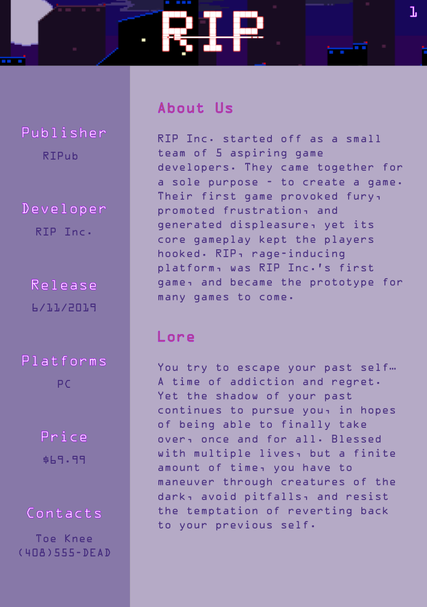
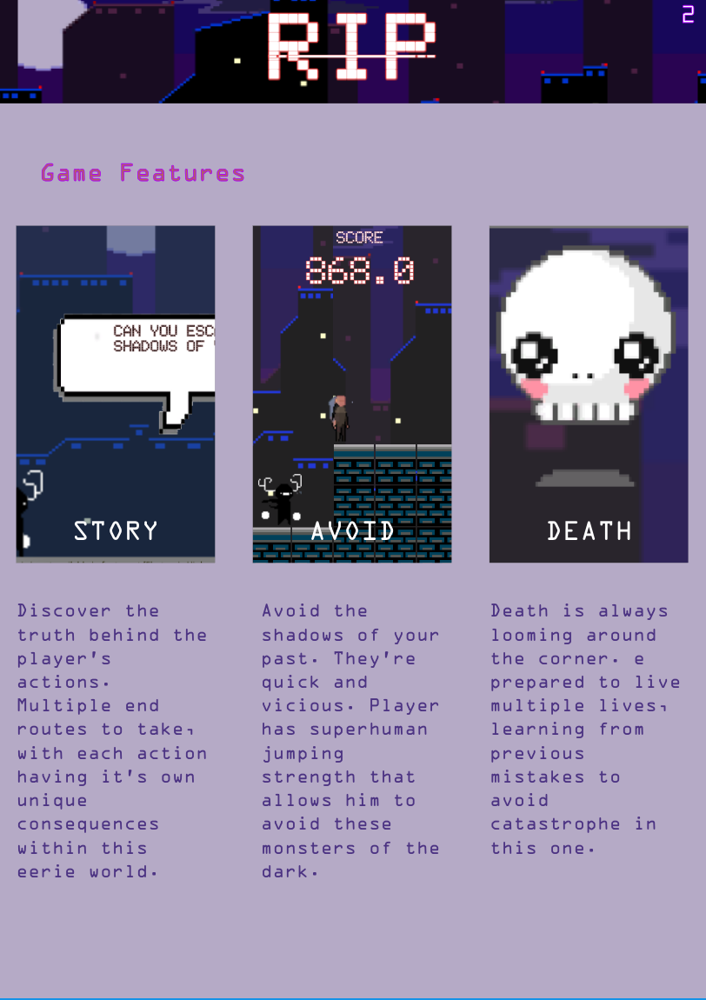
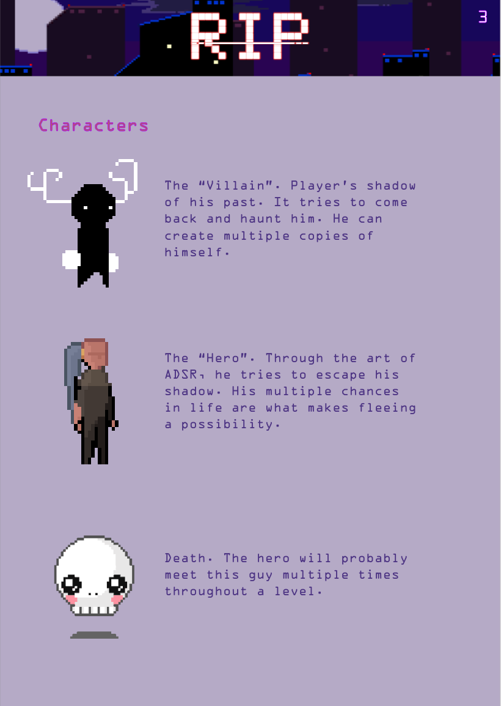

# RIP
Rage Inducing Platformer (RIP) is a 2D platformer built in Unity. The objective is to reach the final checkpoint with the highest remaining score using only jump and movement controls. There are several ways to die in our game, including by lung cancer from smoking cigarettes, colliding with a shadow enemy, and falling off the platforms. Colliding with a beer bottle disorients the user and randomly mixes up the control inputs for a few seconds.

## Team
Name | Main Role | Sub-Role
--- | --- | ---
Maxim Chiao | Movement/Physics | Gameplay Testing
Tony Doan | User Interface | Trailer and Press Kit
Andrew Tsung | Input | Narrative Design
Kyle Andrus | Animation and Visuals | Audio
Caleb Bolton | Game Logic | Game Feel

## Gameplay

  
  

## Press Kit

